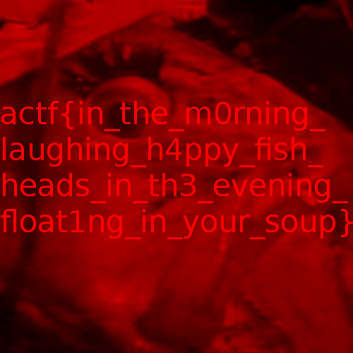

# Fish

## Challenge:

Oh, fish! My [dinner](fish.png) has turned transparent again. What will I eat now that I can't eat that yummy, yummy, fish head, mmmmmm head of fish mm so good...

## Solution:

We have what appears to be a completely transparent PNG:

Running `pngcheck fish.png` doesn’t reveal anything interesting and `strings fish.png` just yields garbage.

If we upload the image to [StegOnline](https://stegonline.georgeom.net/) we don't see much. But when we switch to “Full Red” (or Green or Blue):

Now we can read our flag: `actf{in_the_m0rning_laughing_h4ppy_fish_heads_in_th3_evening_float1ng_in_your_soup}`.
