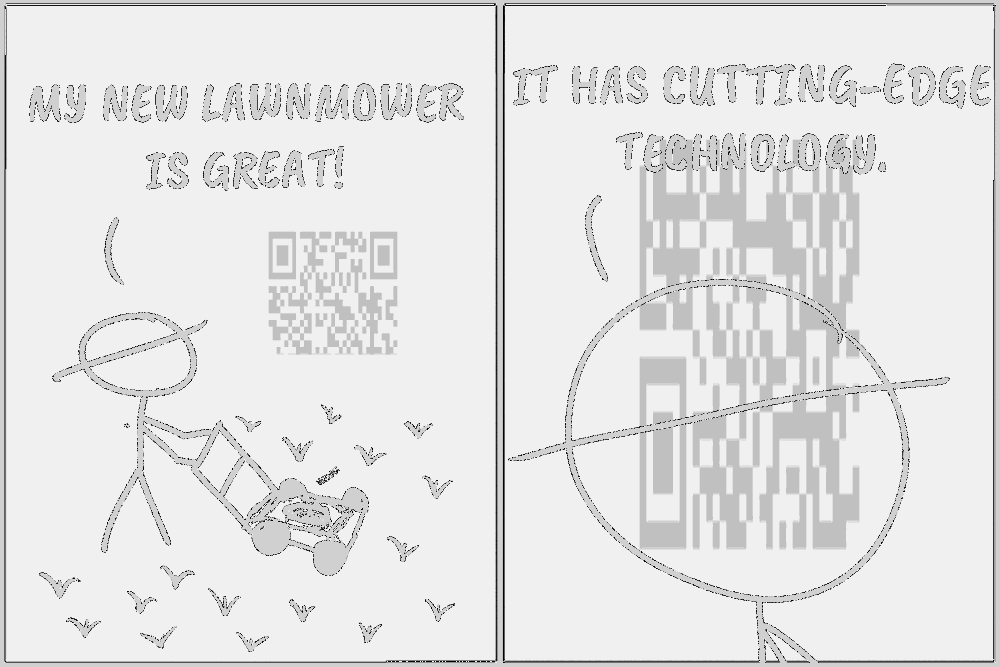
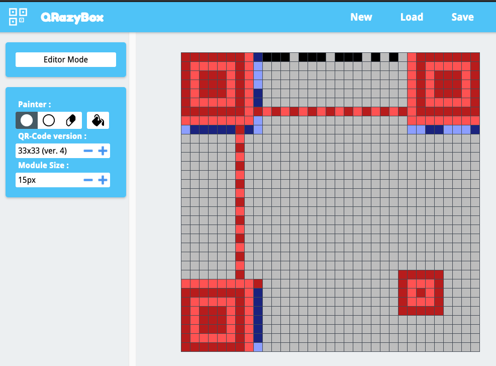
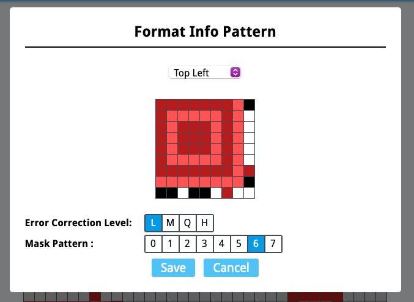

# NSNC

## Challenge:

Enjoy some comics, just like the ones on not-snc.com... :crying:

## Solution:

We're given a PNG with a comic:


Looking closely at the two panes, we can see what appears to be a QR code on the left along with a stretched QR code, or similar matrix barcode, on the right. We can throw the image in [an online tool](https://stegonline.georgeom.net/image) and see the hidden information a little more clearly:



We can see that the two panes make up a single QR code with the top two-thirds on the left and the bottom third, flipped and rotated 90 degrees, on the right. We'll need to stitch them together to get our flag.

We can draw the final QR code out by hand on a 33x33 grid of pixels, to match a [version 4 QR code](https://www.qrcode.com/en/about/version.html) like this. [QRazyBox](https://merricx.github.io/qrazybox/) will help us do this quickly and accurately:



We can play around with the format a bit to make sure it matches our sample. Low error correction and mask pattern 6 seem to be a match.



Now we just need to fill in the rest:


Decoding our QR code gives us the following:

```
MJRXIZT3NZPWKZTGL52GKZLTL5RWC3TUL5RDGX3XGBZG4X3MNFVTGX3SMU2GYX3UGMZXG7I=
```

That looks like Base64. Let's try to decode it:

```
$ echo 'MJRXIZT3NZPWKZTGL52GKZLTL5RWC3TUL5RDGX3XGBZG4X3MNFVTGX3SMU2GYX3UGMZXG7I=' | base64 --decode
0W!5)/)/V
         t/C}F}4US}1Ma}W%
```

That certainly doesn't look like. But before we go through every pixel in the QR code again, let's try the [Magic recipe in CyberChef](https://gchq.github.io/CyberChef/#recipe=Magic(3,false,false,'')&input=TUpSWElaVDNOWlBXS1pUR0w1MkdLWkxUTDVSV0MzVFVMNVJER1gzWEdCWkc0WDNNTkZWVEdYM1NNVTJHWVgzVUdNWlhHN0k9):


And there's our flag! It was Base32 all along: `bctf{n_eff_tees_cant_b3_w0rn_lik3_re4l_t33s}`.
