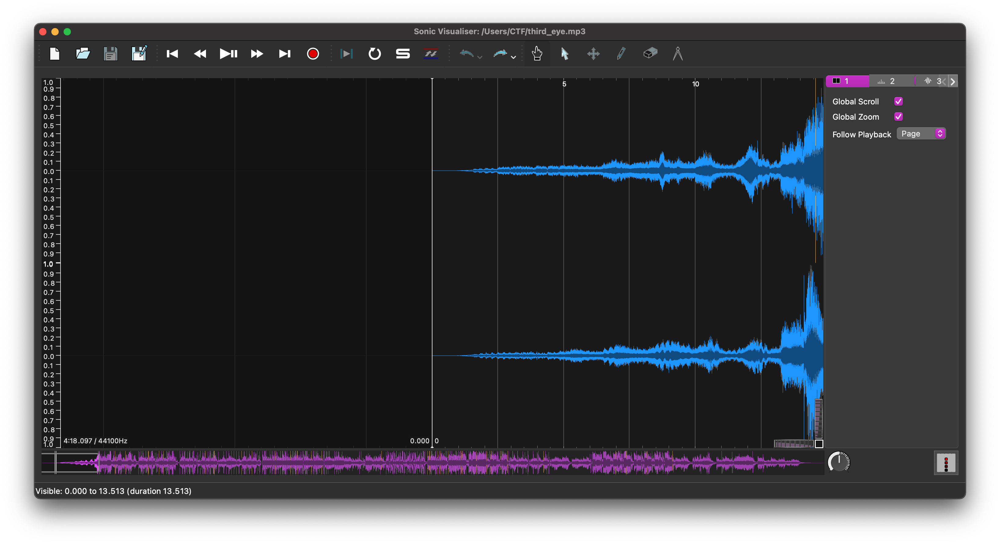
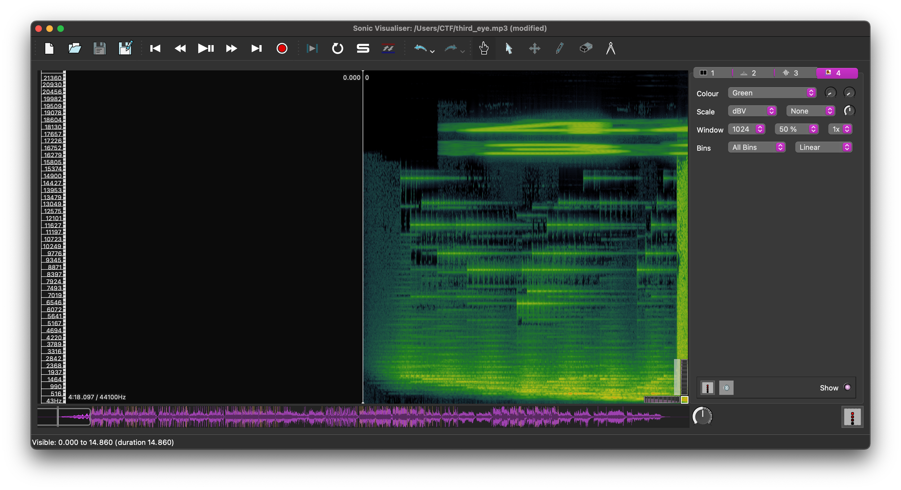
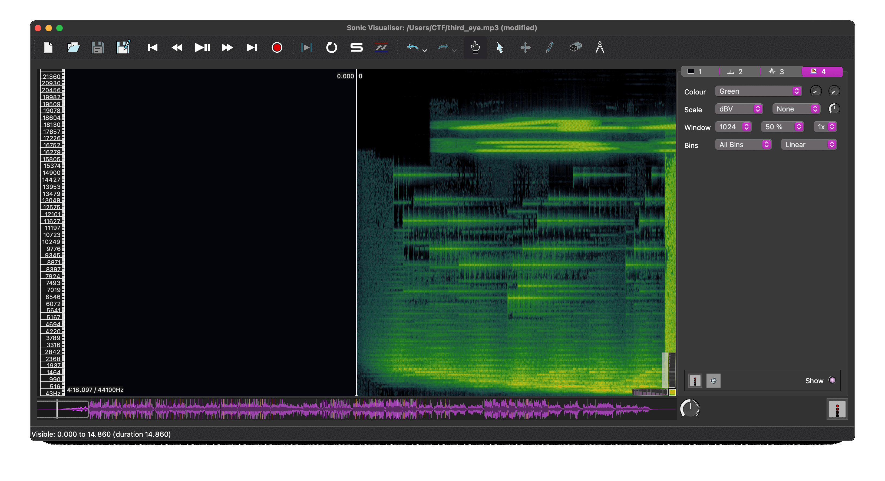

# Third Eye

## Challenge:

This beat is making me see things that I didn't think I could see...

third_eye.mp3: https://drive.google.com/file/d/13Je41zqYscApr-f6GJ5kC8RjeRP6hjUi/view?usp=sharing

## Solution:

The audio file sounds normal. We can open it up in Sonic Vizualizer to take a closer look.

At first glance, everything looks normal:



But if we add a spectrogram, we can see something that looks out of place:



With a little adjustment, we can see some hidden hex:



```bash
446177674354467b73796e337374683373316163737d
```

And that decodes to our flag: `DawgCTF{syn3sth3s1acs}`.
