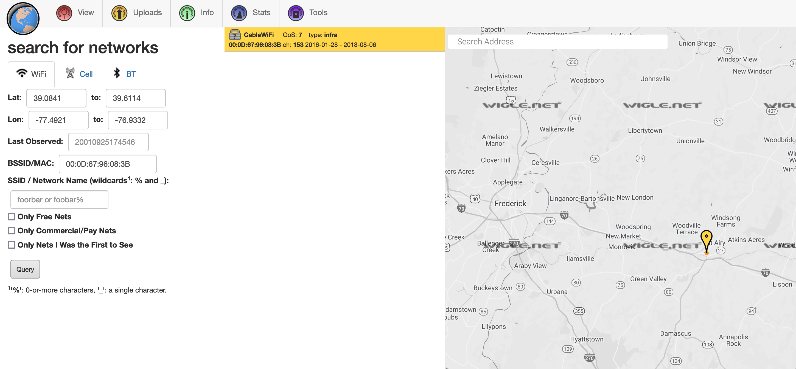

# Identifications

## Challenge:

*Hey man. I'm standing in front of this Verizon central office building. What's its CLLI code?*

*What? No, I don't know where I am, my GPS is broken. I tried to connect to some Wi-Fi so I could download a map or something, but I don't know the password to any of these networks.*

identifications.7z: https://drive.google.com/file/d/1YkzVIwbNKWKG4I0K8F_J8DCC9mqBn2ET/view?usp=sharing

Once you figure out the CLLI code, make sure to wrap it in DawgCTF{}.

## Solution:

We're given two images.

The first is a dark, but clear, picture of a Verizon office:

The second shows the same office in the background, with a list of wireless networks on a laptop in the foreground:

We can search [WiGLE](https://wigle.net/) for the BSSIDs/SSIDs in the list. It's possble they've been logged, which would give us a general geographic location.

We get a hit for `CableWiFi`, in a town called Mount Airy, just west of Baltimore:

Now we can search Google for some of the other networks to get a more accurate position.

If we search for 'Cappuccino', we find a surgery:

Nearby, we find two other locations matching our network names, CarterQue and Katana Sushi. We've found the right place!

If we try street view, we hav a match for our Verizon office:

Our last step is to find the [CLLI code](https://en.wikipedia.org/wiki/CLLI_code) for this location. If we consult [a list of codes for the state of Maryland](https://www.telcodata.us/search-area-code-exchange-by-company-state?company=Verizon&state=MD), and search for Mount Airy, we can find our flag.

Wrapping it in the proper format: `DawgCTF{MTARMDMARS1}`.
