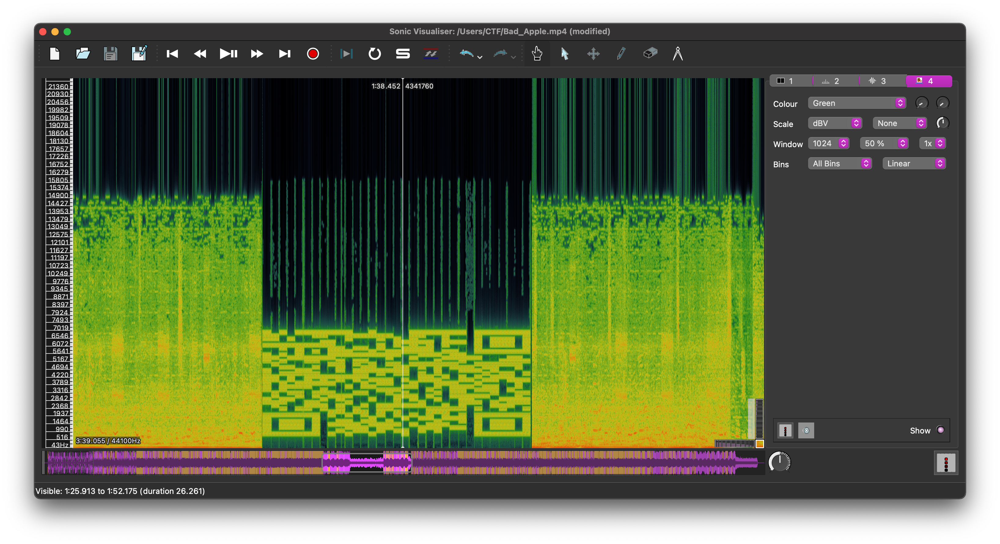
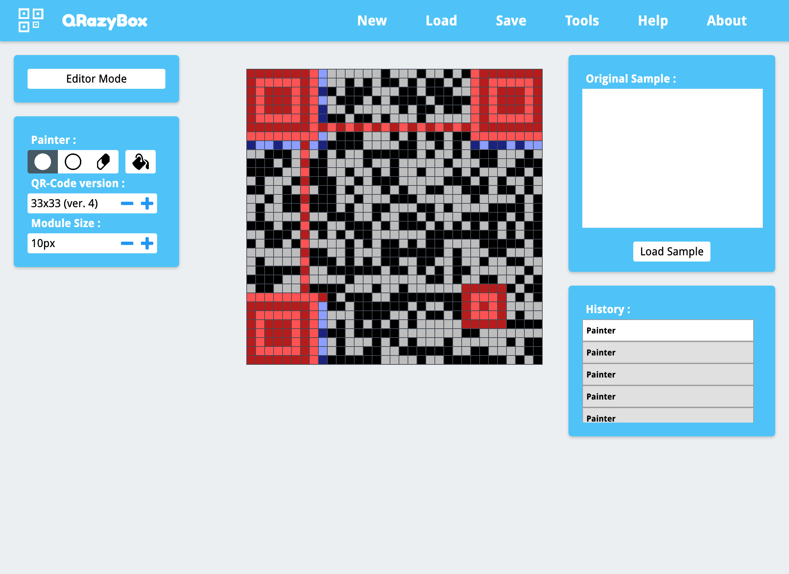

# Bad Apple

## Challenge:

Someone stumbled upon this file in a secure server. What could it mean?

Hint: Did you even listen to the song?

## Solution:

We're given an MP4 video file. At around the 1:33 mark, the audio changes from music to something clearly computer generated.

If we look at [the spectrogram](https://www.sonicvisualiser.org/) around that time, we find that a QR code has been encoded in the audio track:

It's unreadable as is, but we can take our time and repair it using an [online tool](https://merricx.github.io/qrazybox/):

We can scan it to get our flag: `dctf{sp3ctr0gr4msAreCo0l}`.
