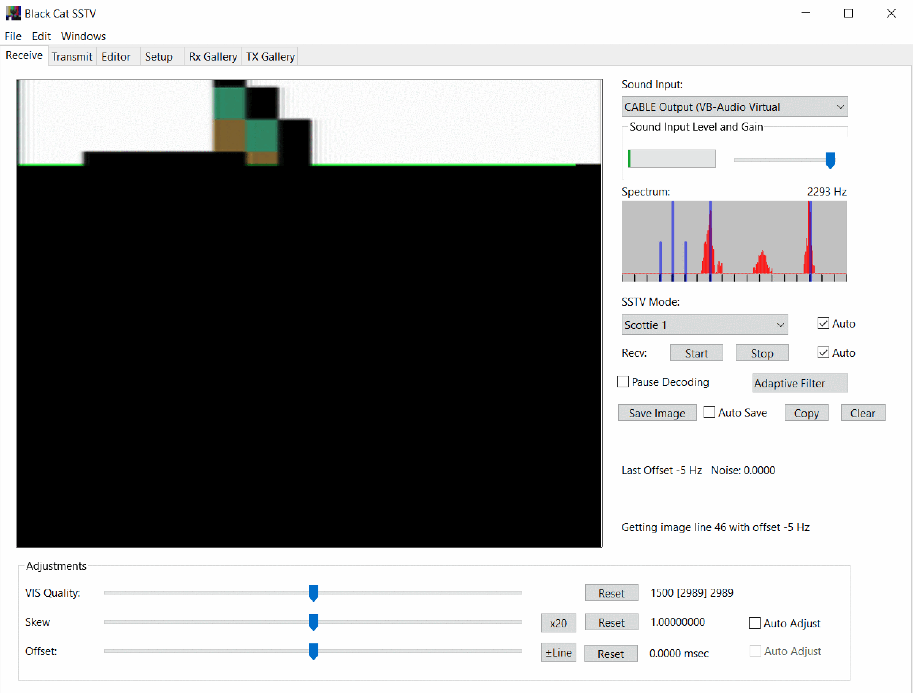

# Extraterrestrial Communication

## Challenge:

Aliens have recently landed on the moon and are attempting to communicate with us. Can you figure out what they are trying to tell us?

Hint: On a completely unrelated note, did you know how they trasmitted the first image from the moon?

## Solution:

We’re given an audio file that has the [telltale sound](https://soundcloud.com/spacecomms/pd120-sstv-test-recording) of an [SSTV transmission](https://en.wikipedia.org/wiki/Slow-scan_television). We can decode the stream to get an image which should contain our flag.

The hardest part is finding a decoder and getting it set up, as this is mostly for people processing signals from external input devices.

We settle on [Black Cat SSTV](https://www.blackcatsystems.com/software/sstv.html) and configure our system to pipe the audio file into it:

After the audio is processed, we have our flag: `dctf{wHat_ev3n_1s_SSTV}`.
