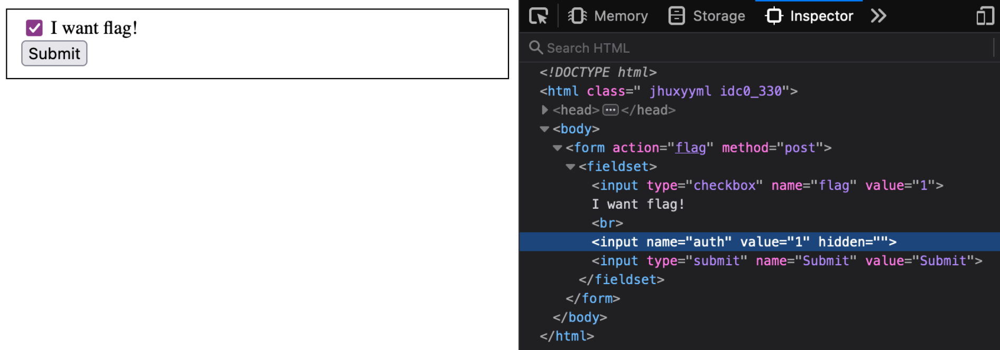

# Simple web

## Challenge:

Time to warm up!
http://dctf1-chall-simple-web.westeurope.azurecontainer.io:8080

## Solution:

The web page has a single form with a checkbox. We can declare your intent to get the flag and submit the form, but we're immediately told we're not authorized.

Inspecting the page, we can see a hidden `auth` field that's submitted with this form. We can flip the field from `0` to `1` and try again:

This time, we're given our flag: `dctf{w3b_c4n_b3_fun_r1ght?}`.
