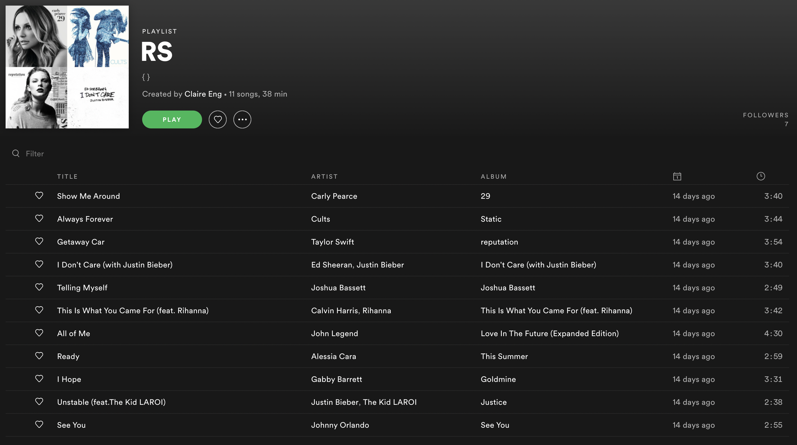

# Music Signs

## Challenge:

Geno occasionally keeps up with his ex’s music interests. What do they say about her personality?

## Solution:

We need to identify Geno’s ex. Heading back to his LinkedIn page we can see a link to https://about.me/genoikonomov. There, we can find links to his Facebook, Twitter, Reddit, GitHub, SoundCloud, and Snapchat accounts.

Facebook works well to identify social connections and, luckily for us, his profile is wide open. We can see his “complicated” relationship status and a link to his ex, Claire Alexa. But neither profile tells us much about her music interests.

If we go back to Gino’s Twitter, we can see that he isn’t following anyone of interest. However, he does have a follower that sticks out: https://twitter.com/eng_claire. And, even better, her profile has a link to Spotify!

Her Spotify is sparse, but it does have a public playlist. It’s called RS and has a subtitle of {}. That smells like a flag. See if you can catch it:

That’s right, our flag is an acrostic using the first letter of every song: `RS{sagittarius}`.
