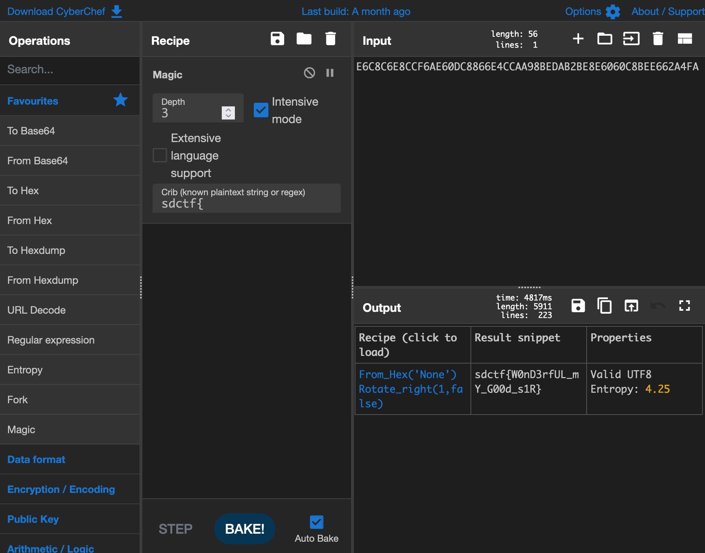

# Lost in Transmission

## Challenge:

I had my friend send me the flag, but it seems a bit...off.

**Flag Message**

https://cdn.discordapp.com/attachments/840007307761156097/840007905616986122/flag.dat

## Solution:

The attached `flag.dat` is a short blob of binary data:

```
E6C8C6E8CCF6AE60DC8866E4CCAA98BEDAB2BE8E6060C8BEE662A4FA
```

It doesn't decode into anything particularly helpful.

[CyberChef's intensive mode](https://gchq.github.io/CyberChef/#recipe=Magic(3,true,false,'sdctf%7B')&input=RTZDOEM2RThDQ0Y2QUU2MERDODg2NkU0Q0NBQTk4QkVEQUIyQkU4RTYwNjBDOEJFRTY2MkE0RkE), combined with `sdctf{` as our crib, helps us right away:



Now we have our flag: `sdctf{W0nD3rfUL_mY_G00d_s1R}`.
