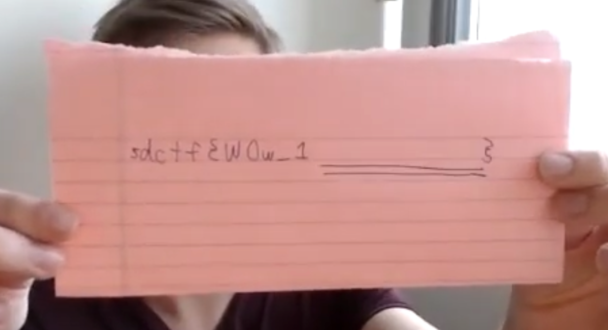
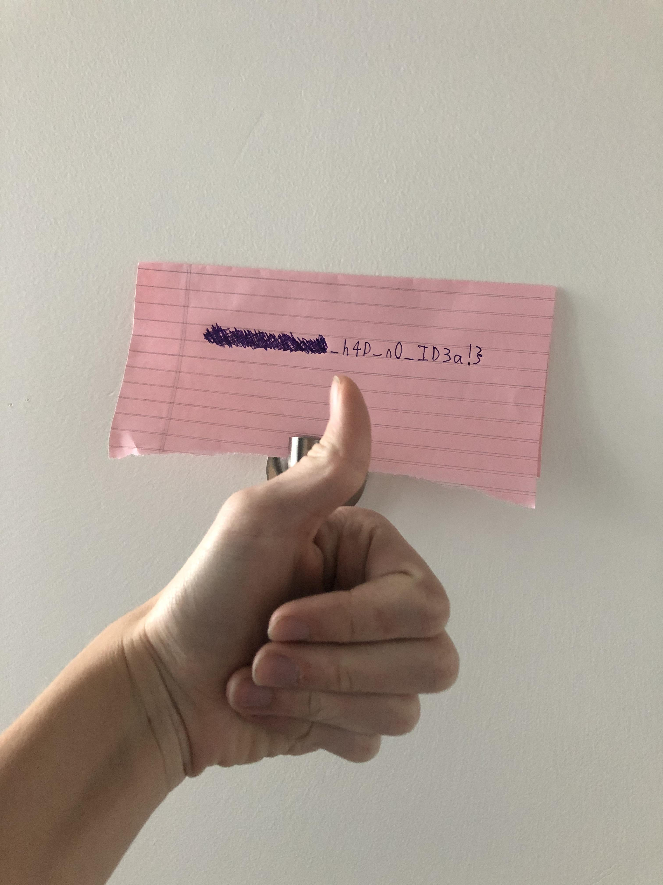

# hIDe and seek

## Challenge:

We don't know the flag, but we know some people who do! Here are their locations:

**Location**

?v=hqXOIZtRYZU

**Location2**

qFHIm0c.jpeg

## Solution:

We have two locations. The first appears to be part of a YouTube video URL and the second looks like Imgur.

As expected, we can find our (unlisted) video at https://www.youtube.com/watch?v=hqXOIZtRYZU. After listening to the narrator read off this portion of the flag, they then show us a paper copy:

For the second half of the flag, we can find our image at https://i.imgur.com/qFHIm0c.jpeg:

Putting them together, we have our complete flag: `sdctf{W0w_1_h4D_n0_ID3a!}`.
