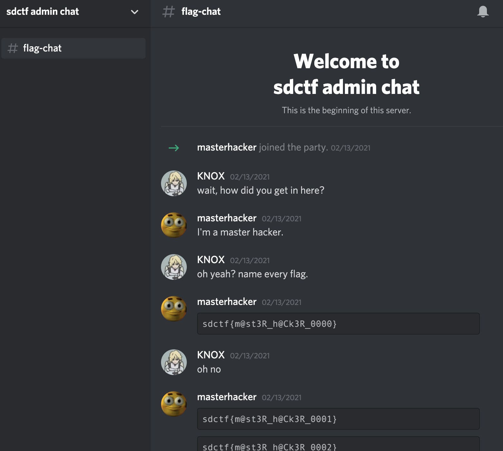
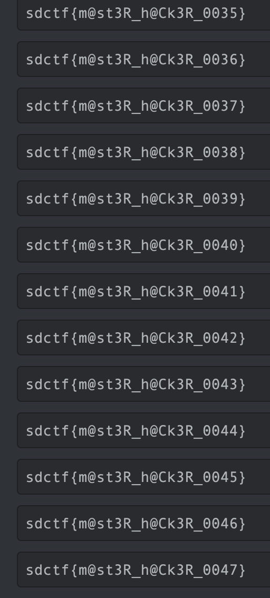

# hIDe and seek 2

## Challenge:

I've gotten some more good intel. Apparently, the following information is the location of another flag!

**First piece of info**

gg/4KcDWnUYMs

**Second piece of info**

810237829564727312-810359639975526490

## Solution:

The first portion looks like a Discord invite.

If we browse to https://discord.gg/4KcDWnUYMs we're invited to "sdctf admin chat" complete with a number of flags:



We find out quickly that everything from `sdctf{m@st3R_h@Ck3R_0000}` through `sdctf{m@st3R_h@Ck3R_9999}` is listed:



We'll need to use the second piece of information to narrow down which of these options is correct.

After some searching, we can find that these match message IDs in Discord. This one, for `9999`, tells us we're getting close `810382777642909716`.

If we choose Copy Message Link from the right side of the message, we can start crafting a link to jump right to the flag:

```bash
https://discord.com/channels/810237829564727308/810237829564727312/810382777642909716
```

We can replace the ID at the end with one of the IDs in the challenge:

```bash
https://discord.com/channels/810237829564727308/810237829564727312/810237829564727312
```

That one takes us to the beginning. But [this one](https://discord.com/channels/810237829564727308/810237829564727312/810359639975526490) takes us right to the flag: `sdctf{m@st3R_h@Ck3R_4807}`.
