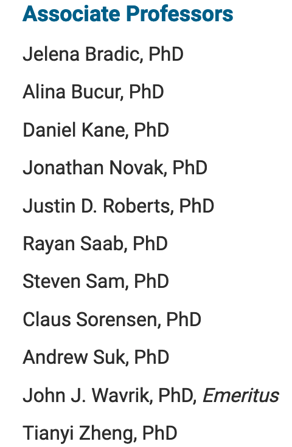

# Speed Studying

## Challenge:

Help, I'm studying for a test, and I need you to find an example problem for me... I'm sure you can find it out there somewhere! I'm trying to remember this professor's name but I'm having trouble...who is the only professor at UC San Diego that is both an Assistant Professor for the Computer Science department, and an Associate Professor for the Mathematics department?

**Note**

The flag is not in the usual `sdctf{}` format. Submit that professor's First and Last name (but not the middle name, if any) separated by a single space. For example, if the professor has first name **John** and last name **Appleseed**, then...

**Please Submit**

`John Appleseed`

## Solution:

We can find a list of Associate Professors of Mathematics here: https://catalog.ucsd.edu/faculty/MATH.html.

Thankfully the list is short:

Instead of finding a similar list for the Computer Science department, we can use Google to search for each person until we find a hit.

It only takes three tries. Searching `ucsd computer science kane` gives us our flag: `Daniel Kane`.
