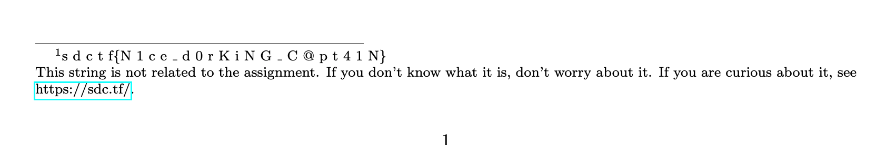

# Speed Studying 2

## Challenge:

Nice, now that you've found Daniel Kane, I need an example from one of his classes. I don't remember anything about it other than its called "The Skyline Problem". Can you find it?

## Solution:

Searching `skyline problem` in Google gives us a ton of results. But if we scope it to `ucsd.edu` we quickly find what we're looking for.

A search for `site:ucsd.edu skyline problem` gives us a couple of PDFs. [The second](https://cseweb.ucsd.edu/~dakane/CSE101%20Problem%20Archive/F18/Homework3.pdf) has an addition at the bottom:

There's our flag: `sdctf{N1ce_d0rKiNG_C@pt41N}`.
