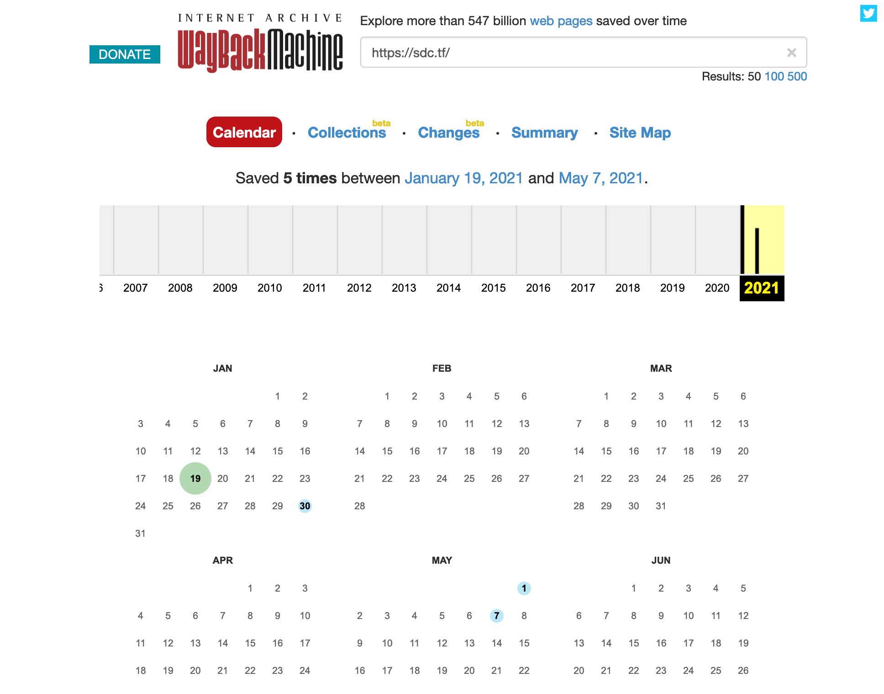

# This flag has been stolen

## Challenge:

We used to offer this flag for free on our official SDCTF website, but unfortunately hackers have stolen it. Sorry.

## Solution:

The official SDCTF website is https://sdc.tf/. We can use [the Wayback Machine](https://web.archive.org/web/*/https://sdc.tf/) at the Internet Archive to pull up older versions of this page:

The oldest revision doesn't have anything for us, but if we check out January 30th:

We can see our flag at the bottom: `sdctf{Th3_L0$t_trE@$ur3_0f_th3_INt3rnEt}`.
