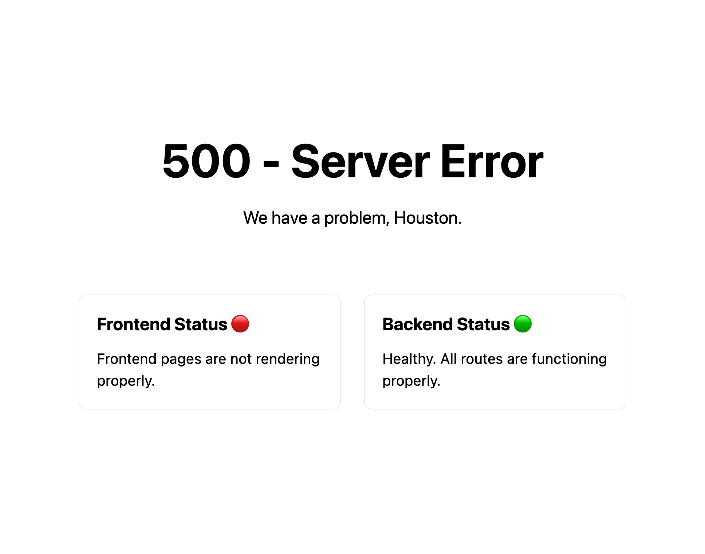

# Apollo 1337

## Challenge:

Hey there intern! We have a rocket launch scheduled for noon today and the launch interface is down. You'll need to directly use the API to launch the rocket. No, we don't have any documentation. And quickly, our shareholders are watching!

**Website**

https://space.sdc.tf/

## Solution:

The site has a `500` error, with widgets alerting us to the status of the frontend and backend applications:



The backend status doesn't appear right away, telling us that an API is being hit behind the scenes to populate the widget.

If we check the network traffic request, we can see a `GET` to `https://space.sdc.tf/api/status?verbose=`:

```json
{
  "status": "health",
  "longStatus": "Healthy. All routes are functioning properly.",
  "version": "1.0.0",
  "routes": [
    {
      "path": "/status",
      "status": "healthy"
    },
    {
      "path": "/rocketLaunch",
      "status": "healthy"
    },
    {
      "path": "/fuel",
      "status": "healthy"
    }
  ]
}
```

That gives us a few more endpoints to look at.

Checking `/fuel` gives us names of 6 different pumps:

```json
[
  {
    "name": "west1 pump",
    "id": 0
  },
  ...
  {
    "name": "lil pump",
    "id": 5
  }
]
```

But `/rocketLaunch` tells us we're getting closer:

```json
request body must be json
```

Let's give that a try:

```bash
$ curl -H 'Content-Type: application/json' https://space.sdc.tf/api/rocketLaunch -d '{"rocket": 0}'
rocket must be a string
$ curl ... '{"rocket": "0"}'
rocket not recognized (available: triton)
$ curl ... '{"rocket": "triton"}'
launchTime not specified
$ curl ... '{"rocket": "triton", "launchTime": 0}'
launchTime must be a string
$ curl ... '{"rocket": "triton", "launchTime": "0"}'
launchTime not in hh:mm format
$ curl ... '{"rocket": "triton", "launchTime": "12:12"}'
launchTime unapproved
```

After some trial and error we're getting there. We know the launch time is noon from our challenge text:

```bash
$ curl ... '{"rocket": "triton", "launchTime": "12:00"}'
fuel pumpID not specified
```

And we know the pumps from the `/fuel` endpoint:

```
$ curl ... '{"rocket": "triton", "launchTime": "12:00", "pumpID": 0}'
/fuel/0 is either not active or not above 50% capacity
...
$ curl ... '{"rocket": "triton", "launchTime": "12:00", "pumpID": 4}'
frontend authorization token not specified
```

It looks like the last bit of the puzzle is our authorization token.

We can try the Cloudflare `__cfduid` cookie set on the home page:

```
$ curl ... '{"rocket": "triton", "launchTime": "12:00", "pumpID": 4, "token": "dff471399c41b03e6304fc54206d5bd4c1620577544"}'
frontend authorization token invalid
```

That didn't work, but we know that this is a JavaScript frontend application. Maybe there's a token embedded in the source code.

Searching each JavaScript include for `token`, we eventually come across [index-25d435e5ad95f79f3af3.js](https://space.sdc.tf/_next/static/chunks/pages/index-25d435e5ad95f79f3af3.js):

```javascript
(e.headers={Token:"yiLYDykacWp9sgPMluQeKkANeRFXyU3ZuxBrj2BQ"})
```

Now we can pass this authorization token to our request:

```json
$ curl ... '{"rocket": "triton", "launchTime": "12:00", "pumpID": 4, "token": "yiLYDykacWp9sgPMluQeKkANeRFXyU3ZuxBrj2BQ"}'
rocket launched. sdctf{0ne_sM@lL_sT3p_f0R_h@ck3r$}
```

And we get our flag: `sdctf{0ne_sM@lL_sT3p_f0R_h@ck3r$}`.
