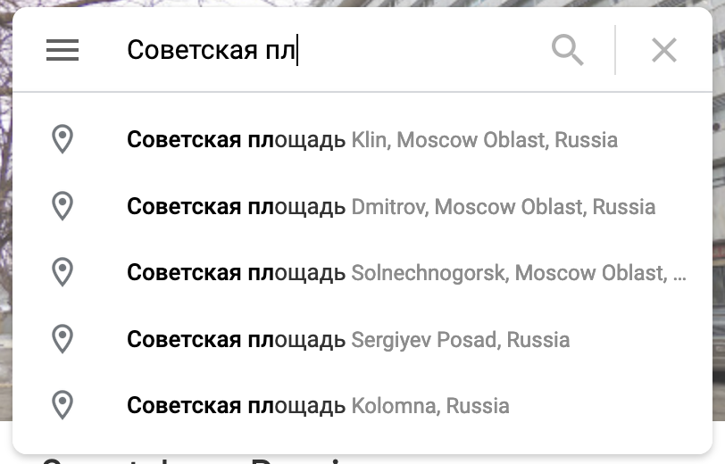
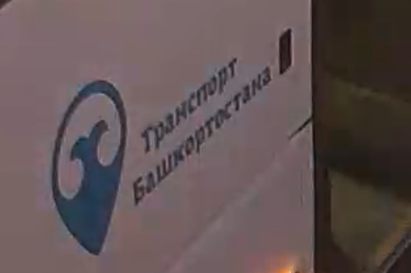
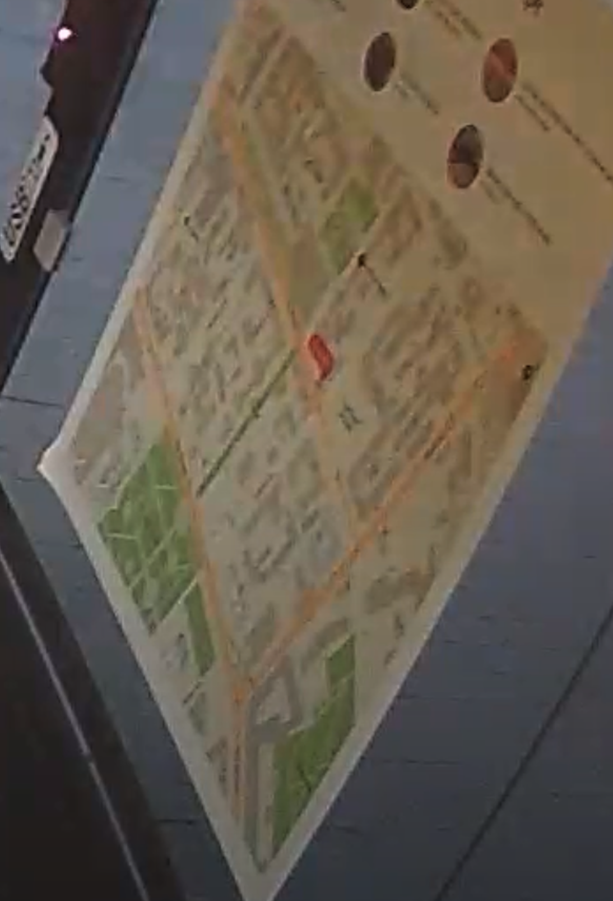
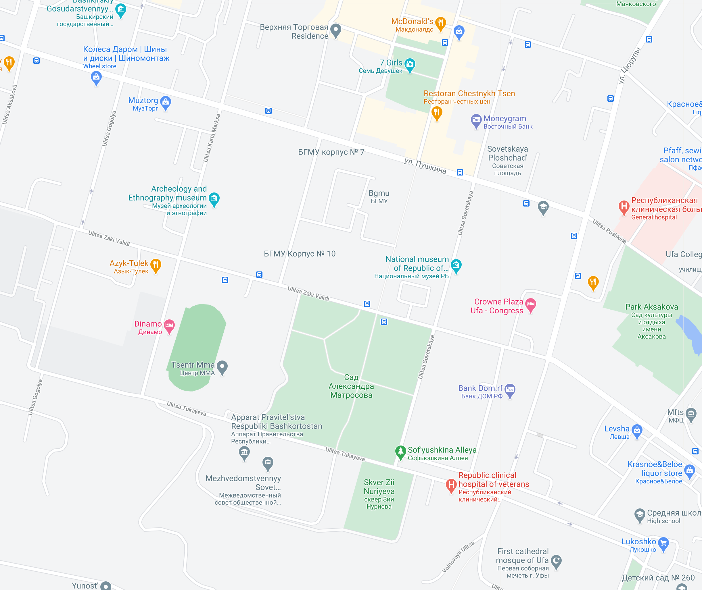

# Justin 3

## Challenge:

Justin only gave us this camera's live feed and said "Hey guys look! I'm on TV!" Can you find the name of the street he's on?

format: UMDCTF-{Memory_Lane}

we do not own any IP found besides the one listed below

`curl http://chals5.umdctf.io:8000`

## Solution:

We’re presented with a live video feed of a bus stop. We can see a map and a lot Russian writing, possibly even the name of the station:

As it gets later, the camera feed gets harder to parse, switching from color to black and white and back as the ambient light fluctuates. Thankfully, we have all we need in the screenshot we captured.

The clearest word above the map is “Советская”, which translates to “Soviet”. We also see “Совет” at the top, which is “advice” or “tip”. We can try to have Google help us by autocompleting what we know:

If we try “Советская пл…”, we see a number of results for “Советская площадь”, or “Soviet Square”.

When a bus stops, we can catch a glimpse of a logo:

It’s tough to make out, but Google autocomplete fills it in for us: “транспорт башкортостана”, “Transport Bashkortostan”. So we know that we’re looking in Bashkortostan, and probably in the capital city of Уфа (Ufa).

If we look closely at the map, we can clearly see a park:

Searching Ufa for a park with a similar pattern, we find Cад Александра Матросова:

The red indicator on the map points to our flag: `UMDCTF-{Ulitsa_Pushkina}`.
