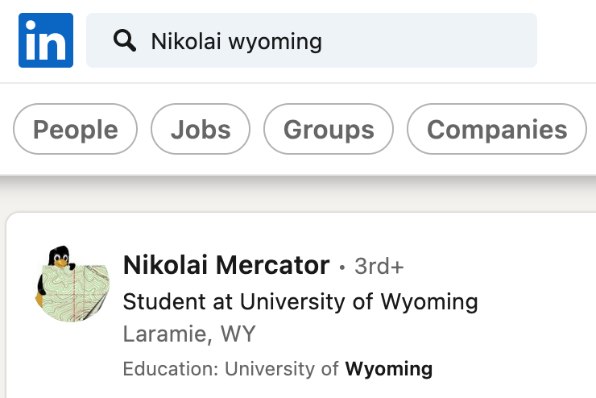
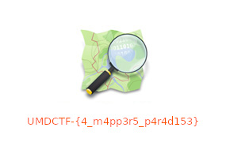

# Nikolai 1

## Challenge:

My friend Nikolai went off to school in Wyoming this year and he hasn't been responding to my texts. I'm worried about him since he has no family or friends out there. Can you find out what he has been up to?

## Solution:

We’re given very little to go on, just a first name, a state, and the implication that the person we’re looking for traveled there for school.

A Facebook search for Nikolai doesn’t tell us much, even filtering by college towns. LinkedIn, however, seems to have what we’re looking for:

They’re a student at the University of Wyoming. Their name, Nikolai Mercator, is a reference to [Gerardus Mercator](https://en.wikipedia.org/wiki/Gerardus_Mercator), commonly known for the [Mercator projection](https://en.wikipedia.org/wiki/Mercator_projection). Going further, the profile links to a Twitter account which references the [OpenStreetMap project](https://en.wikipedia.org/wiki/OpenStreetMap).

We need to see who has been committing to OSM in the general vicinity of our target to identify Nikolai’s account. It doesn’t take long to find him, scrolling through the [history in OSM](https://www.openstreetmap.org/history#map=15/41.1377/-104.7842) for edits around Cheyenne, Wyoming and looking for “Nikolai”.

Something stands out on his profile:

That's our flag: `UMDCTF-{4_m4pp3r5_p4r4d153}`.
