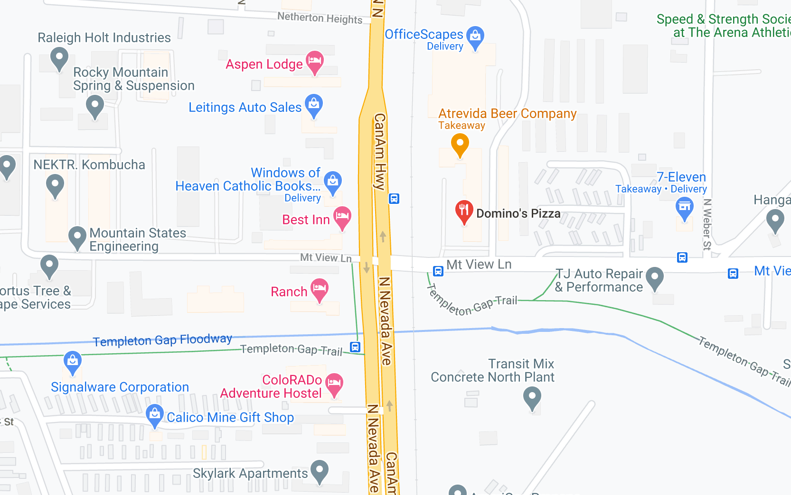

# Nikolai 2

## Challenge:

Nikolai's school recently contacted his parents since he hasn't been seen in his dorm or classes for over a week. They know you are an OSINT CHAD and asked for your help. Can you figure out where he ran off to?

Flag Format: UMDCTF-{20_W_34th_St_New_York_NY_10001}

P.S. If you enjoy this challenge you might also enjoy https://www.tracelabs.org/

Hint: All of the accounts you found in Nikolai 1 may be important for this solve

Warning, you only have *five* guesses

## Solution:

Looking at Nikolai’s OSM history, we can see a clear path from Laramie, Wyoming, to Cheyenne, and into Colorado from Fort Collins down to Colorado Springs. Once they’re in Colorado springs, we can see a fairly small area where they’ve traveled on their walks:

We know from Nikolai’s Twitter account that they’re staying at a “lodge” close to a gas station and a Domino’s Pizza. A quick search of Colorado Springs for Domino’s Pizza finds us a location right in the middle of Nikolai’s check-ins. And very close by we see Aspen Lodge:

The address is our flag: `UMDCTF-{3990_N_Nevada_Ave_Colorado_Springs_CO_80907}`.
