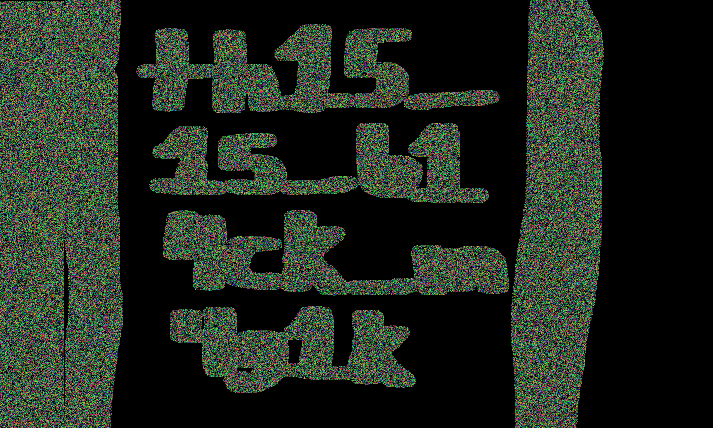

# Magic

## Challenge:

I spy with my magic-eye a flag!

Note: FaZe Apex helped me learn this trick

Note: Wrap what you get with `UMDCTF-{}`

## Solution:

We’re given a PNG that looks like a 3D stereographic image:

We can cross our eyes and see our flag, visualized here with the help of an online tool:

Our flag: `UMDCTF-{th15_15_b14ck_m4g1k}`.
